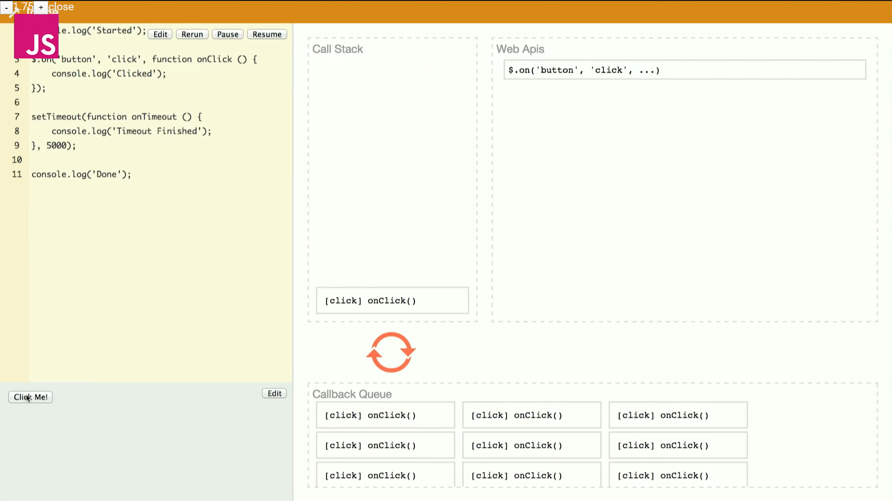

## Ajax & Event Loop & Fetch and Promise
## 同步與非同步
> 非同步的目的：避免 block（阻塞）。
- 直線執行程式碼的話，如果有一行要等很久，後面都會被卡住。瀏覽器上的網頁如果遇到 block，就無法做任何事，點擊也會沒反應。於是，callback function 拿來處理這類狀況，那行讓他跑，先去做後面的事，等跑完後再回來處理那部分的事情。通常，call back function 的參數慣例是(err, data)。
- ajax(Asynchronous JavaScript and XML) 就是非同步執行

-----

## Event loop
### Event loop 是什麼？
js 背後執行機制裡的一個控制中樞（像是秘書），安排目前進行的工作（stack）和待辦清單（queue）的順序。  
之所以有 stack 和 queue，就是為了處理非同步、callback 的狀況，安排執行順位

### Javascript 在瀏覽器上的背後架構
- stack：js 主要工作區，如果 function 裡面包了很多層，就會從下往上，一層層堆上去，操作完就 pop 掉
- task queue：等待區，工作區清空後，就可以排新任務進去
- render queue：瀏覽器顯示頁面的部份，瀏覽器會希望一直重新 render、維持流暢性，但如果 stack 運行太久、工作量大，畫面就會卡住
- webapi：瀏覽器多出來的工作區，包含計時區（setTimeOut）、準備區（跟 api 拿資料）
- event loop：協調部，觀察 stack 的狀態，趁機丟 queue 的內容進去


(截圖自 Philip Roberts 演說影片 https://www.youtube.com/watch?v=8aGhZQkoFbQ)<br>
參考資料 [What the heck is the event loop anyway?](https://vimeo.com/96425312)

### 所以非同步怎麼進行？
- callback function 被放入 callback queue（callback queue 裡面又分為 macro task 和 micro task）
- call stack 空了，queue 的東西就會被 event loop 丟進去
- call stack 開始執行東西，清空後 event loop 繼續工作，檢查有沒有待完成事項

-----

### Fetch
> fetch 是什麼：新時代的 XML Http Request，避免 call back hell 所生產出來的方式

```javascript
// 原始方法： XMLHttpRequest 方式
const request = new XMLHttpRequest();
request.onloan = function(res){
    ......
}

// Fetch 方式
fetch('網址')   // 直接打網址會用 Get 方式，是 Ajax，不換頁
  .then(function(res){
    console.log(res);
    let json_info = res.json();  // 把資料變成 json 格式
    let text_info = res.text();  // 把資料變成純文字
    return json_info;
  })
  .then( result => {   // .then 會接收上一個函式的 return，然後拿來繼續操作。這個叫做 chaining，像 jQuery 也可以
      console.log(result);   // 123
  })
  .then( promise => {
      console.log(promise);   // 如果傳 promise 進去的化，會直接在裡面執行
  })
  .catch( err => {
      console.log('err',err);   // 要拿結果用 then，有錯誤要檢視用 catch
  })

const api = fetch('網址');   // api 結果的格式會是 promise，一種物件格式
api.then( var => {
    ...
  })
  .catch( var => {
      ...
  })


//  promise 
const doFitst = new Promise(function(resolve,reject){
    resolve(...);   // 成功的動作
    reject(...);   // 失敗的動作
})
doFirst.then( result => {
    console.log(result);  // 上面 resolve 傳什麼，這邊就會接收到什麼。當上面跑完，就會跳到這裡繼續工作
}).catch( err => {
    console.log(err);
})

// 多層call back 會長這樣
doFirst()
  .then( () => doSecond() )
  .then( () => doThird() )
.....

// 自己寫的（類） fetch 模組
const get = function(url){
    return new Promise(
        (resolve,reject) => {
            const request = new XMLHttpRequest();
            request.open('GET',url);
            request.onreadystatechange = function(){
                if(request.readyState == 4 && request.status == 200){
                    resolve(request.responseText);  // 成功的動作
                }
            }
            request.onerror = function(err){
                reject(err);   // 失敗的動作
            }
            request.send();
        }
    )
}
get('要放的網址').then(result=>{
    console.log(result);
}).catch(err=>{
    console.log(err);
})
```

### Promise
> promise 是什麼：一個即將完成或失敗的非同步操作，以及隨之產生的值。
- 標準化和非同步操作有關的程式碼，讓大家有統一的規範去呼叫
- promise 有三種狀態：pending(未完成)、fulfilled(成功)、rejected(失敗)
- promise 的優點：簡化了 callback function 的鎖鏈

```javascript
doSomeThing.then((resolve, reject) => {
  return resolve
})
.then(res => {
  return something
})
.then(newRes => {
  someAction()
})
.catch(err => {
  failureAct()
})
.then(() => {
  failureAct2()
})
```

參考資料<br>
- [JavaScript 中的同步與非同步（上）：先成為 callback 大師吧！ by Huli](https://blog.huli.tw/2019/10/04/javascript-async-sync-and-callback/)
- [並行模型和事件循環 by MDN](https://developer.mozilla.org/zh-TW/docs/Web/JavaScript/EventLoop)